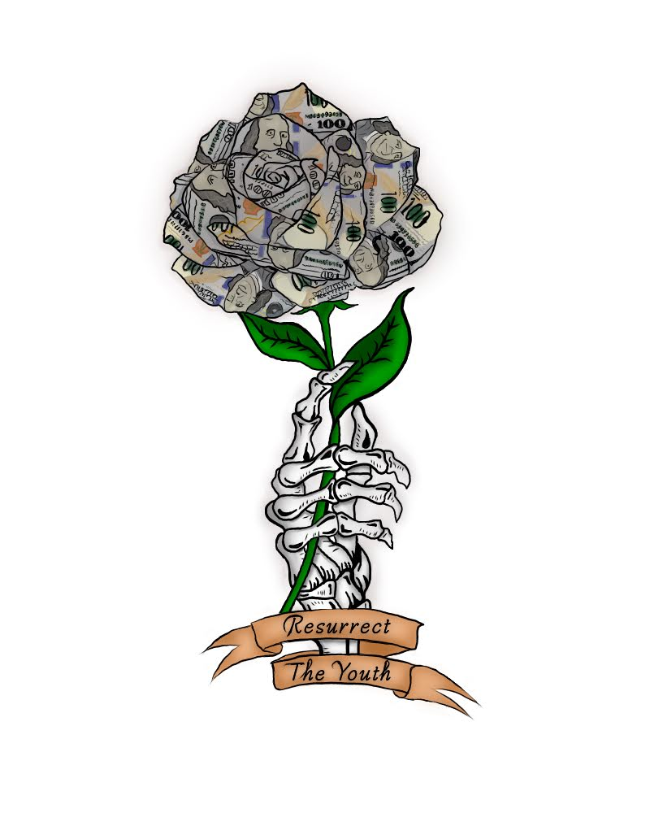
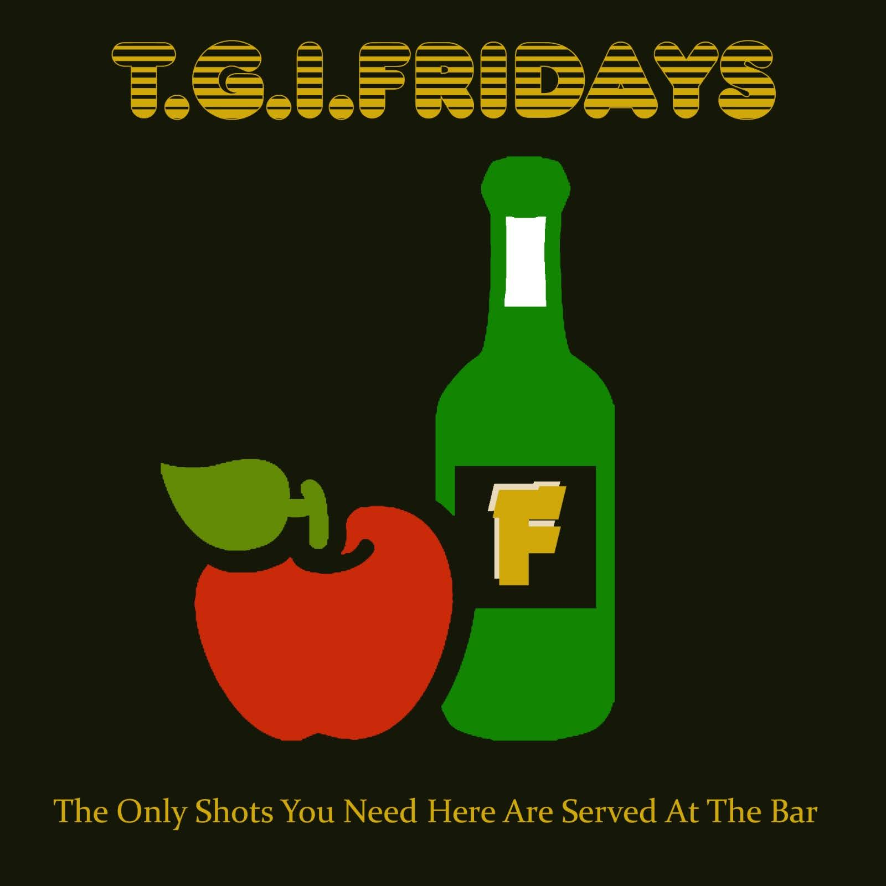
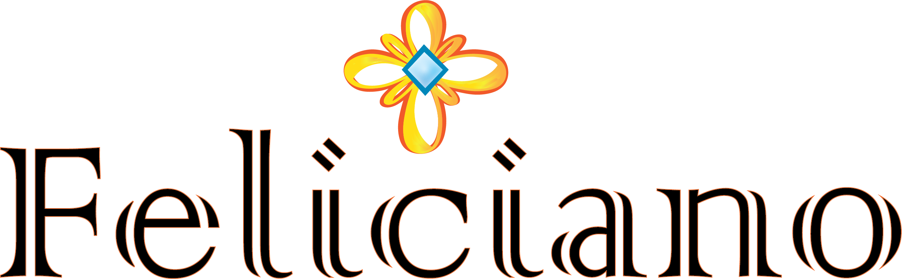

# {{title}}
 <main class="page-projects">
        <!-- your page content here... -->
        <a href="project1.html">
        <section class="project">
          

            
          

        </section>

  <section class ="intros">
          <h2>Resurrect The Youth</h2>
          

            
A 2022 art comission, to create a logo, by a new non-profit organization called Resurrect The Youth.

          

        </section>
        </a>

 <a href="project2.html">
        <section class="project">
          

            
          

        </section>
        
 <section class ="intros">
          <h2>TGI Fridays</h2>
          

            
An academic assignment, given during the Fall 2021 semester, to bring life back to a restuarant chain that has been losing profit due to the COVID-19 pandemic.

          

        </section>
        </a>

 <a href="project3.html">
        <section class="project">
          

            
          

        </section>

 <section class ="intros">
          <h2>ICE Rebranded</h2>
          

            
An academic assignment, given during the Fall 2020 semester, to complete redesign the logo and label of any drink of our choice.

          

        </section>
        </a>
      
  <a href="project4.html">
        <section class="project">
          

            
          

        </section>
        
 <section class ="intros">
          <h2>Eternal Happiness</h2>
          

            
An academic assignment, given during the Spring 2021 semester, to create an original logo for our chosen client and their line of work.

          

        </section>
        </a>

  <a href="project5.html">
        <section class="project">
          

            
          

        </section>

  <section class ="intros">
          <h2>The Great Tenochtitlan</h2>
          

            
An academic assignment, given during the Spring 2021 semester, to create or redesign a map of any kind.

          

        </section>
        </a>

  <a href="project6.html">
        <section class="project">
          

            
          

        </section>

  <section class ="intros">
          <h2>Type Director's Club</h2>
          

            
An academic assignment, given during the Spring 2021 semester, to create a simple brochure using some of the images handed to us, typeface, colors, and shapes.

          

        </section>
        </a>
      </main>
