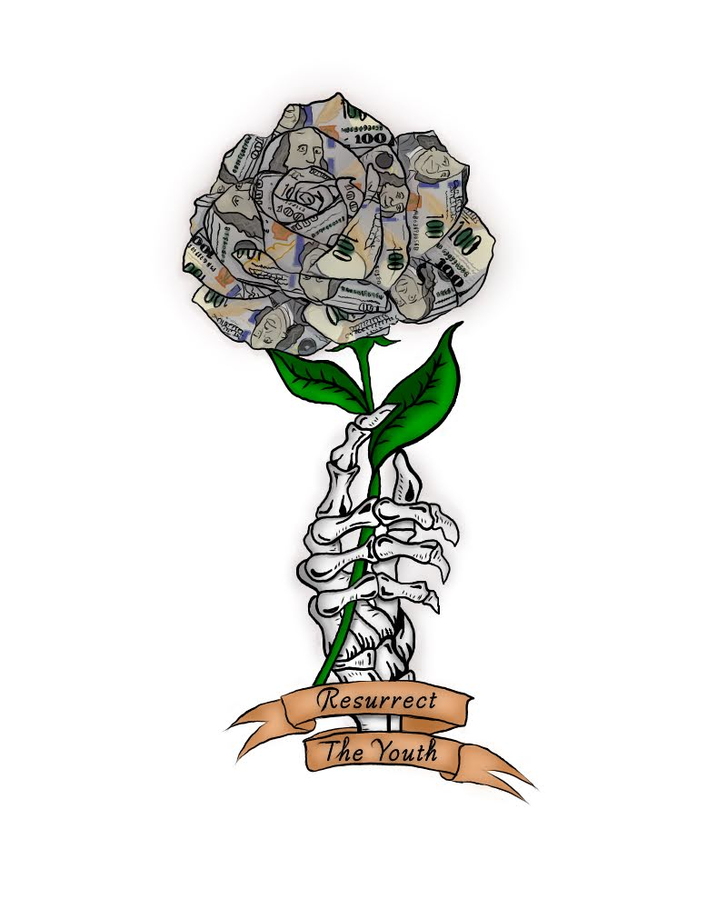

<h3>Resurrect The Youth</h3>
      
<main class="project1">
  <section class="p1">
  
I was reached by a new non-profit organizaton, called Resurrect The Youth, to help them fix a job done by another designer. They had reached out to this designer, spoke about their idea, gave in a sketch, and they were unhappy with the results. Because of this, they came to me asking if I could fix up the design to bring alive their vision. Here is the original image they received:

           
  

  
First of all, this group wanted the rose to have the petals spread out a bit more. Secondly, they wanted some shading to be done on the skeletal hand to look a bit more realistic. Thirdly, they wanted the sign to be moved where it is underneath the hand but still attached instead of floating on its own. Lastly, they wanted me to fix up the colors and text for they just were not happy with them.

  
  
  

  
After this, they discussed among themselves and asked me if I could draw $100 bill details on the petals. Here is the final version:

  

</section>
</main>