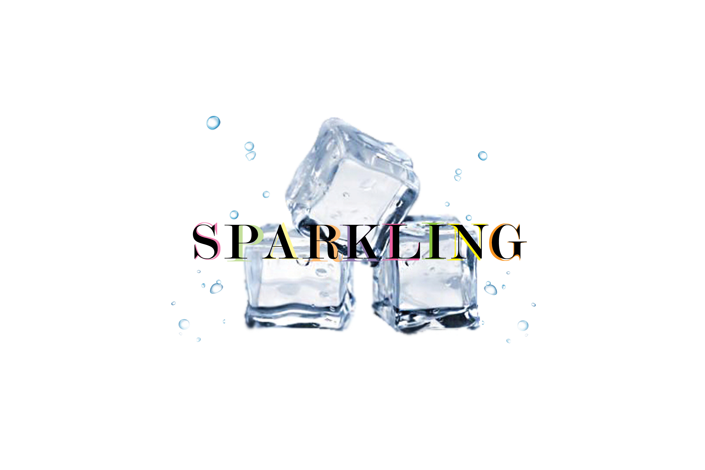

<h3>Ice Rebranded</h3>
      
<main class="project1">
<section class="p1">
  
The following images are from a final project, during the Fall 2020 semester, that consisted of completely redesigning the label and logo of any drink of our choice. My brand of choice was ICE.

            
  

  
For the logo, I wanted a more direct approach by implementing an image of actual ice and some air bubbles. I wanted to keep the text "sparkling", but make it more colorful due to the fact that this brand is known for having a variety of different flavored drinks in different colors. I started with a very rough sketch and then made great use of Adobe Photoshop.

  
  

  
For the label, I decided that I wanted to keep the classic clear background, but once more, I wanted to go at a more direct appraoch. Due to this being a type of soda, I wanted to add some bubbles that would look like they are floating to the top - all the fizz that rises after opening a new soda bottle. I also wanted to implement another way of showing the type of flavor it is, so I added real fruit to be floating around with the fizz. Once more, I made great use of Adobe Photoshop but also Adobe InDesign to set everything up.

 
  
  
</section>
</main>