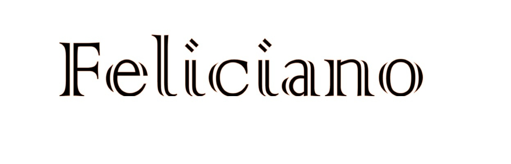
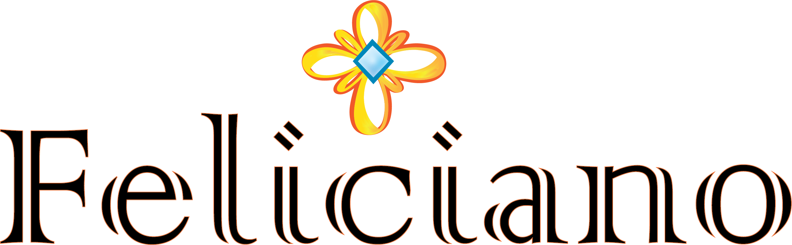
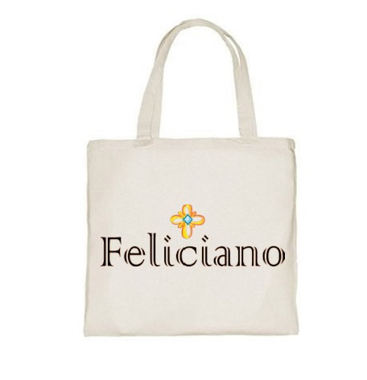
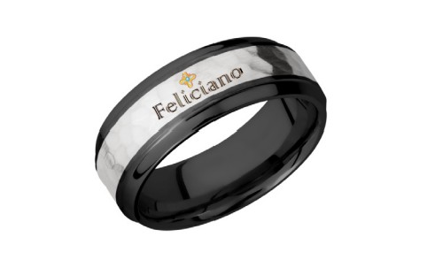
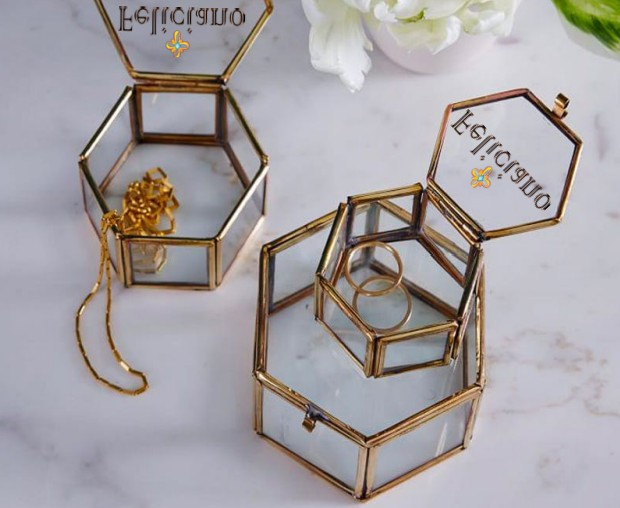

 <h3>Eternal Happiness</h3>
      
      <main class="project1">
        <section class="p1">
            
As class project during the Spring 2021 semester, I had to design an original logo for a make-believe client and their business. My chosen client owned a jewelry company, so my objective was to design something that brought significance to the elegant and modern jewelry to be created by my client.

            
            
            
The logo for <em>Feliciano</em> is made up of two important parts.The name itself and the symbol I chose to implement on top of the name. The name Feliciano is an Italian name that means happiness, so they name had to be included for the idea I had.

            

            
To give this logo a more elegant but meaningful look, I made use of an Irish Celtic symbol. The Bowen Knot (also known as the Heraldic Knot) is a Celtic symbol that stands for infinity/eternal and love. Gold was specifically chosen for the reason that pure gold does not tarnish. A symbol of eternity that will never tarnish. Not to mention, I designed it as a flower to signify something blooming - a new beginning.

            

            
I created a logo for my client that symbolizes eternal happines. That's what their company would bring with every piece of jewelry they make.

            
            
            
            
            
        </section>

      </main>