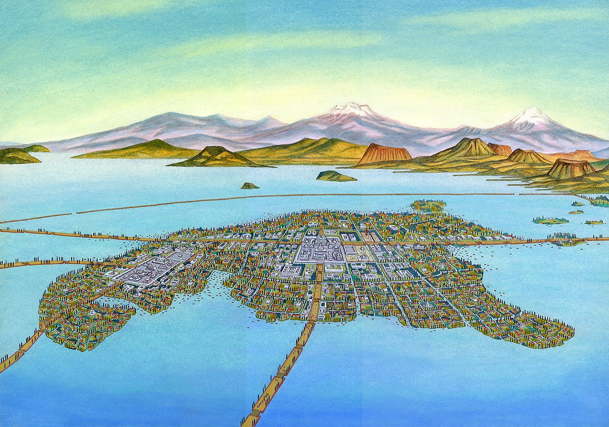
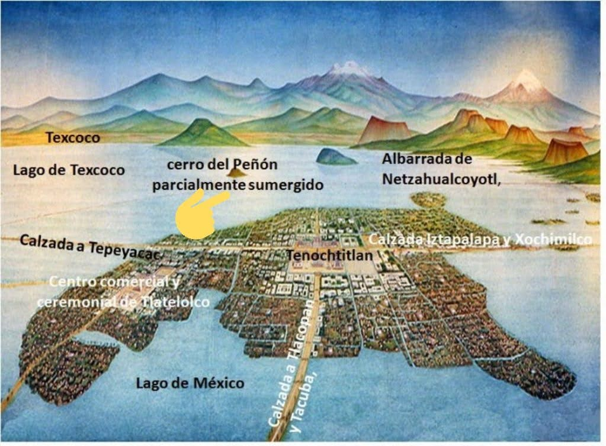
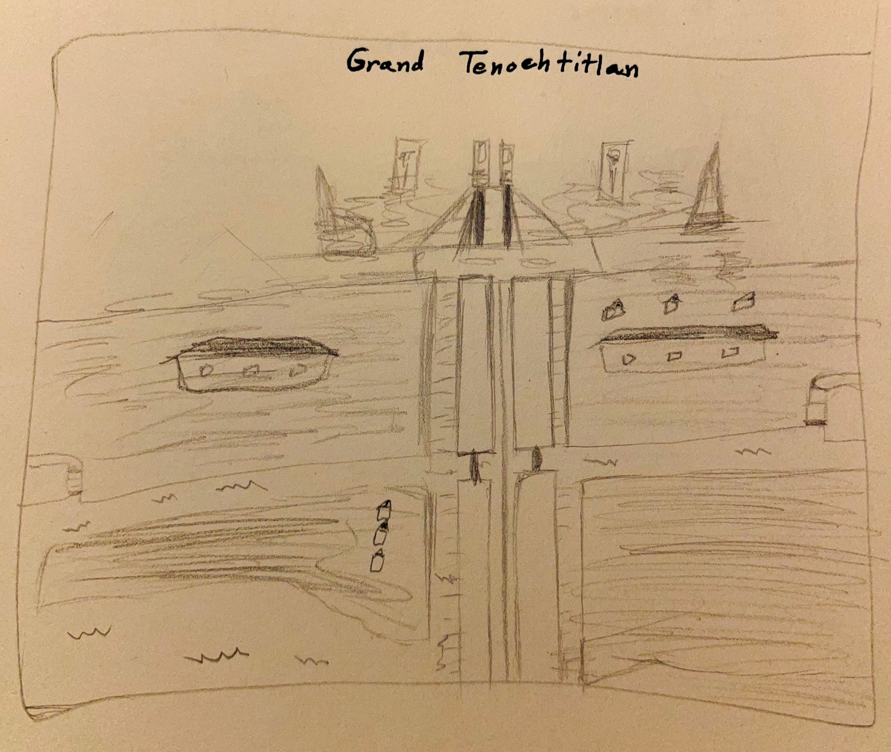
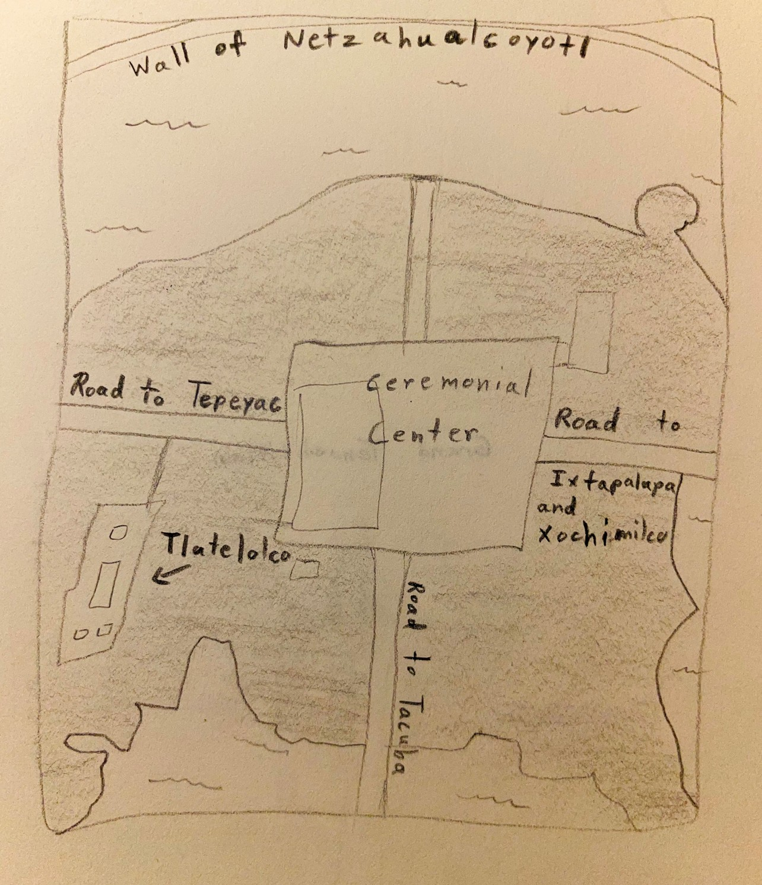
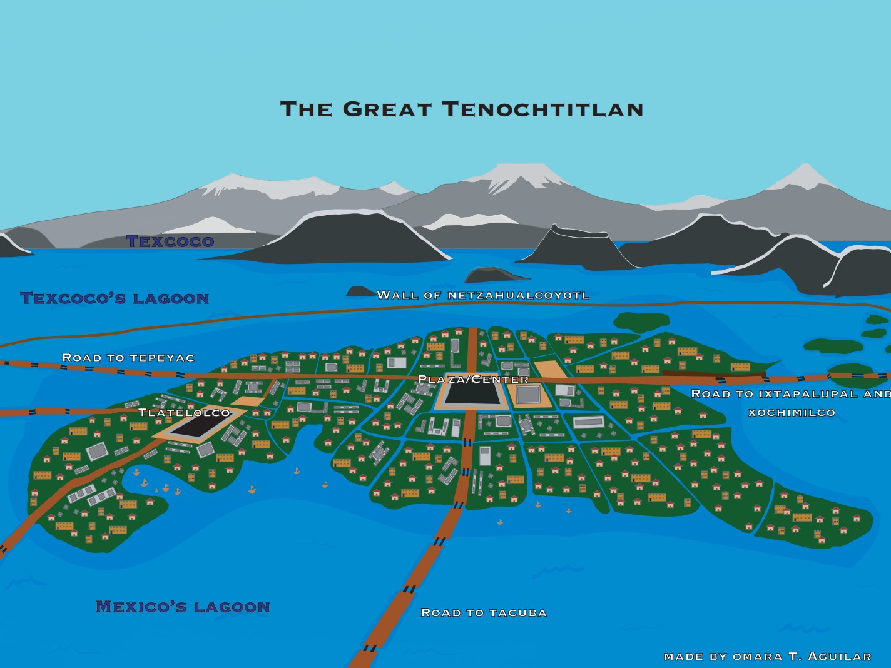

 
<h3>The Great Tenochtitlan</h3>
      
<main class="project1">
<section class="p1">
  
As an assignment during the Spring 2021 semester, my professor had instructed the class that she wanted us to design a map of anything. It could be a make believe world in a book, a game, a country, anything at all. All she asked is for us to do is extenssive research in order to make our maps as accurate as possible. Personally, I decided I wanted to go back to my roots and recreate a digital map of the gorgeous Aztec city of Tenochtitlan. To complete this assignment, I started with some very rough sketches and then made use of Adobe Illustrator.

  
  
  
  

  
The end results were a simple, detailed, colorful, and labeled modern map of Tenochtitlan.

  
  </section>

  </main>