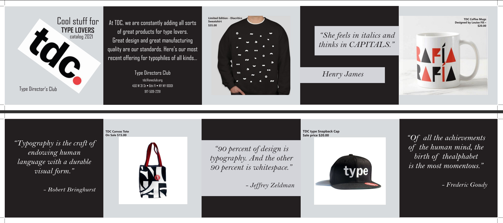

   <h3>Type Director's Club</h3>
      
      <main class="project1">
        <section class="p1">
            
The project below was an academic assignment from the Spring 2021 semester. The professor wanted us to recreate a brochure but with the images, color-scheme, text, and shapes of our own choice. The catch was that everything had to only be done on Adobe InDesign. Though simple, we had to be careful with sizes and making sure everything was well unifromed. To put it in another way, we had to pretend as if we were going actually design this for Type Director's Club.

            
            
        </section>
      </main>